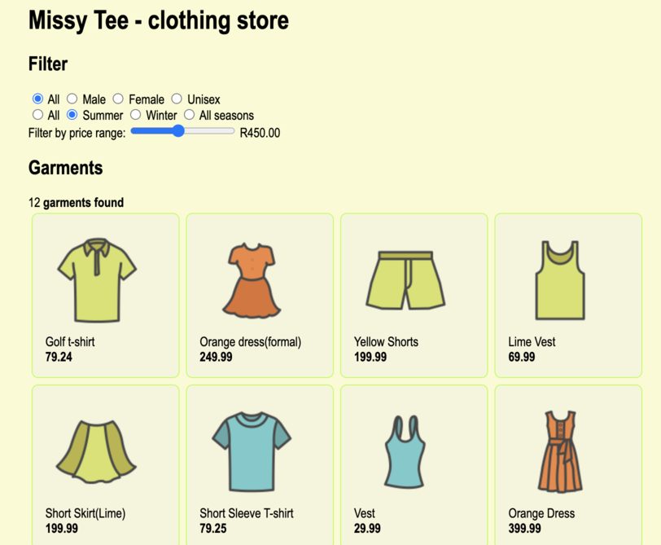
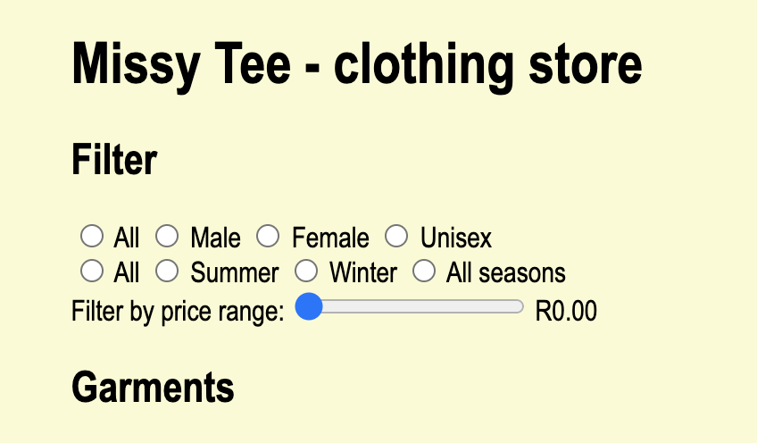

# Create a basic API

To create an API you need a web server. We will use `ExpressJS` the JavaScript Web Server to create an API that provides data for `Missy Tee` clothing store. It's still work in progress and should look like this once the API is working.



Once the API is working the garments on the page will be filterable using the radio buttons and slider on the page.

All the client side JavaScript DOM code is already created in the `./public/` folder. And is hosted in ExpressJS as static file. You will need

## Start here

Start by:

* Forking and cloning this repository,
* creating a file called `index.js` (the file is created already in this repo)
* instantiate a npm package
* installing `ExpressJS`
* open VSCode
* add the `node_modules` folder to your `.gitignore` file
* setup a basic express instance.

By using these commands:

```
touch index.js
npm init
npm install express
touch .gitignore
code .
```

Add this to your `index.js` file to setup ExpressJS.

```js
const express = require('express');
const app = express();

// enable the static folder...
app.use(express.static('public'));

// import the dataset to be used here

const PORT = process.env.PORT || 4017;

// API routes to be added here

app.listen(PORT, function() {
	console.log(`App started on port ${PORT}`)
});
```

You can run the `index.js` file using `node` or `nodemon`.

You should see a basic web page in the browser at: `http://localhost:4017` that looks like this.



If you click on the radio buttons and use the slider nothing will happen. And there will be errors in the Google Developer Console.

Take a look at the client side source code in the `./public/app.js` file.

## Setup the garment dataset

Import the dataset using `require`.

Use the `require` statement to import the garments dataset in the `garments.json`

```js
// import the dataset to be used here
const garments = require('./garments.json');
```

This is a list of garments that we will be using as data for our API.

## API end points

Create API end points that allows us to find:

* Garments by gender or season
* Garments by gender & season
* Garments costing less than a given price

You can create your API end points using [url parameters](https://expressjs.com/en/5x/api.html#req.params) or [query parameters]() in ExpressJS.

> You can read more [here](https://localcoder.org/node-js-difference-between-req-query-and-req-params) about query parameters and query strings.

Create these end points:

URL		| Type      | Description
--------|------|------
`/api/garments` | GET| use query params for gender & season `/api/garments?gender=Female&season=Winter`
`/api/garments/price/:price` | GET | pass the max price in as a parameter. `/api/garments/price/235`

## Create a basic garment listing route

```js
app.get('/api/garments', function(req, res){
	// note that this route just send JSON data to the browser
	// there is no template
	res.json({garments});
});
```

Test the route in the browser using `http://localhost:4017/api/garments`

To use the route in the client side use `axios.get` - use the `app.js` file in the `public` folder. Render the data in the `garments` class element in `index.html` using the compiled Handlebars template instance.

## Add filter to the route

Next use query parameters to add filtering to the `/api/garments` endpoint - allow for filtering on `gender` & `season`.

Filter using the lists `.filter` method.

```js

app.get('/api/garments', function(req, res){

	const gender = req.query.gender;
	const season = req.query.season;

	const filteredGarments = garments.filter(garment => {
		// if both gender & season was supplied
		if (gender != 'All' && season != 'All') {
			return garment.gender === gender 
				&& garment.season === season;
		} else if(gender != 'All') { // if gender was supplied
			return garment.gender === gender
		} else if(season != 'All') { // if season was supplied
			return garment.season === season
		}
		return true;
	});

	// note that this route just send JSON data to the browser
	// there is no template
	res.json({ 
		garments : filteredGarments
	});
});
```

Note how this endpoint is called in the web app:

```js
function filterData() {
	axios
		.get(`/api/garments?gender=${genderFilter}&season=${seasonFilter}`)
		.then(function(result) {
			searchResultsElem.innerHTML = garmentsTemplate({
				garments : result.data.garments
			})
		});
}
```

## Add a pricing filter route

To filter garments by a `maxPrice` create a `get` route that take a parameter a `price` parameter like this `/api/garments/price/:price`

```js
app.get('/api/garments/price/:price', function(req, res){
	const maxPrice = Number(req.params.price);
	const filteredGarments = garments.filter( garment => {
		// filter only if the maxPrice is bigger than maxPrice
		if (maxPrice > 0) {
			return garment.price <= maxPrice;
		}
		return true;
	});

	res.json({ 
		garments : filteredGarments
	});
});
```

You can call this api route once done in the browser using something like this: `http://localhost:4017/api/garments/price/300` or this: `http://localhost:4017/api/garments/price/50` - try other values for the price parameter as well.

Once this API end point is working the slider filter in the front end should be working. Note how this API endpoint is calles using axios: `axios.get(`/api/garments/price/${maxPrice}`)`

Make sure to restart your app and test the filtering at: `http://localhost:4017`

## Deploy

Add your source code to GitHub.
Deploy the app to Heroku.
Share the link to your deployed App with the mentors `gwi-mentors@projectcodex.co`
